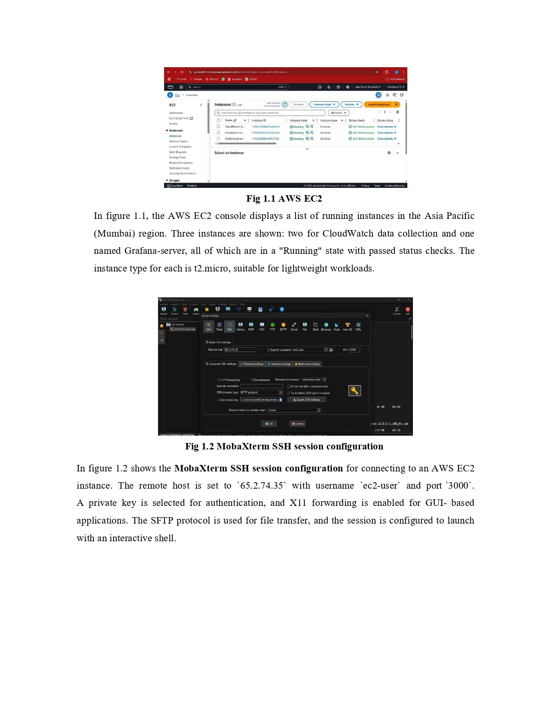
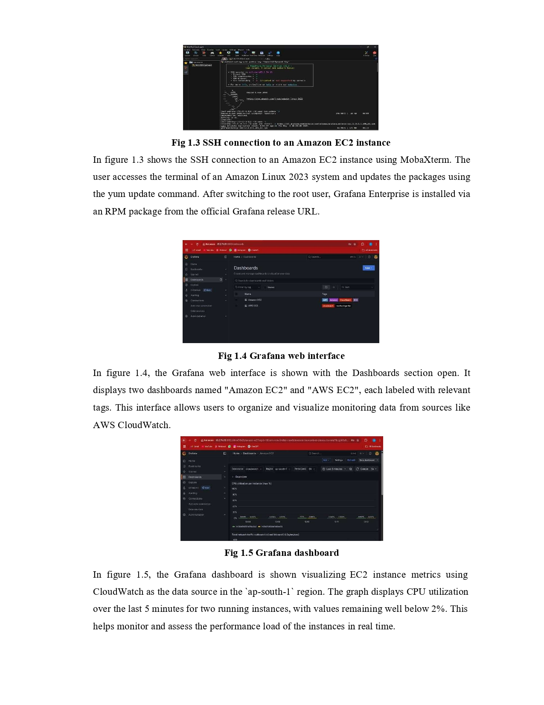
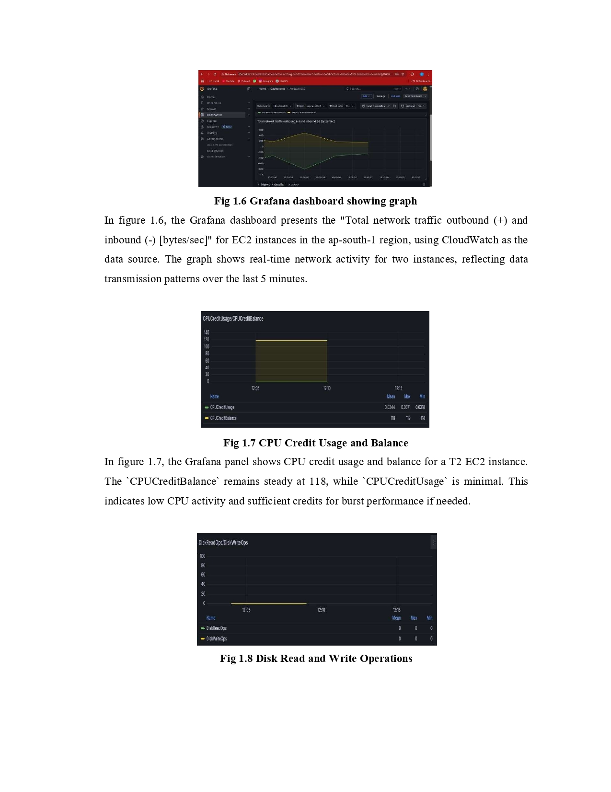
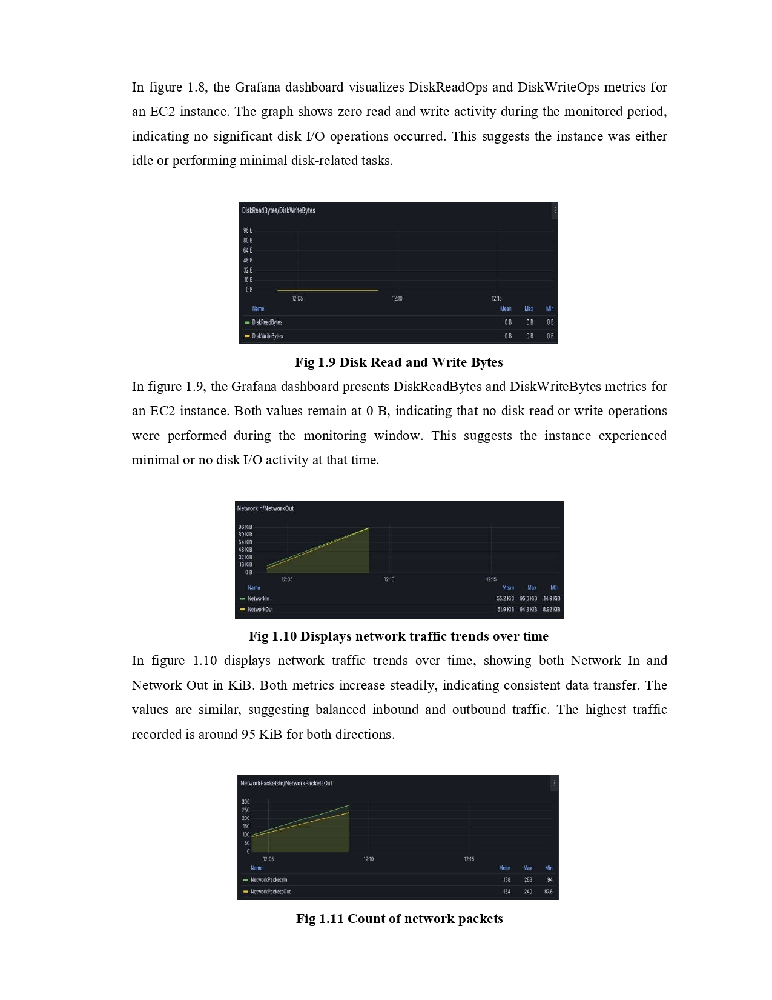
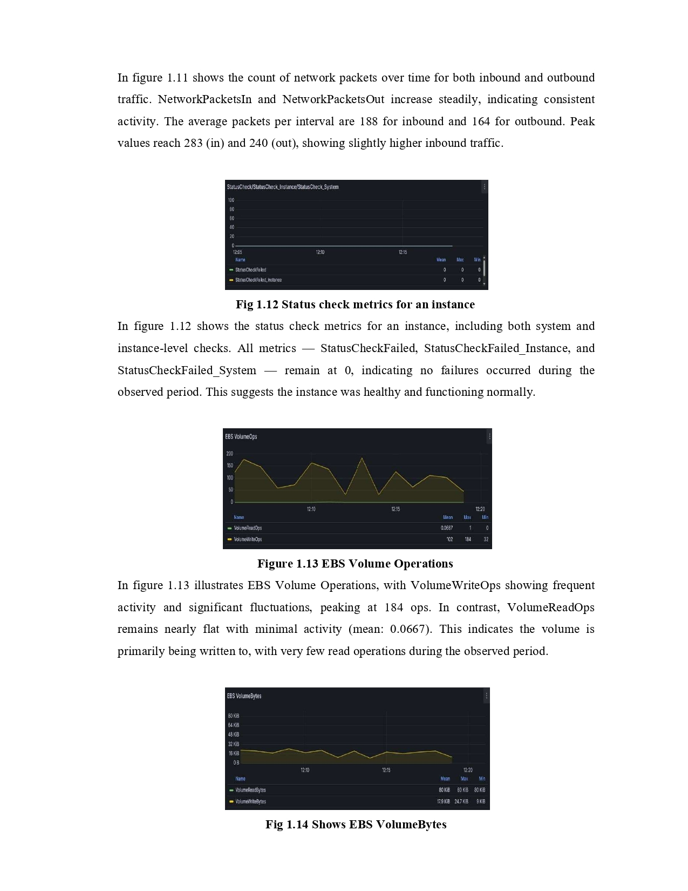
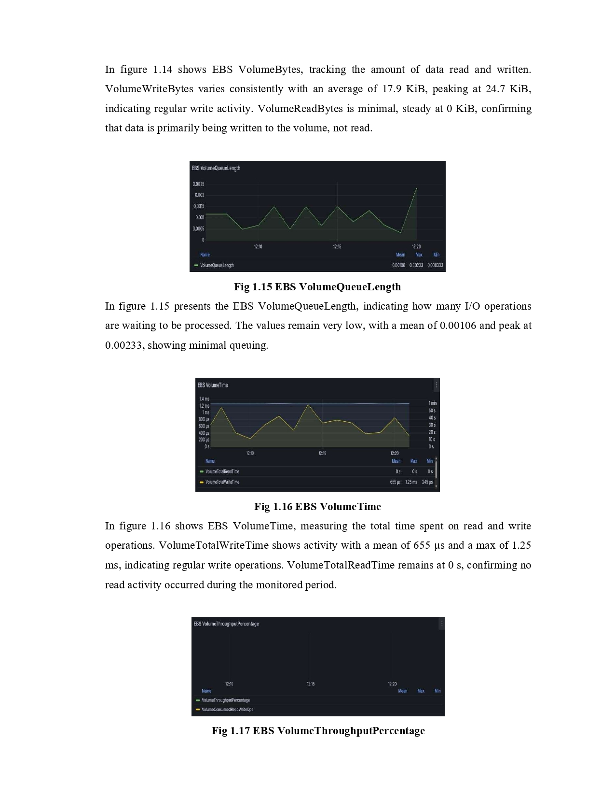
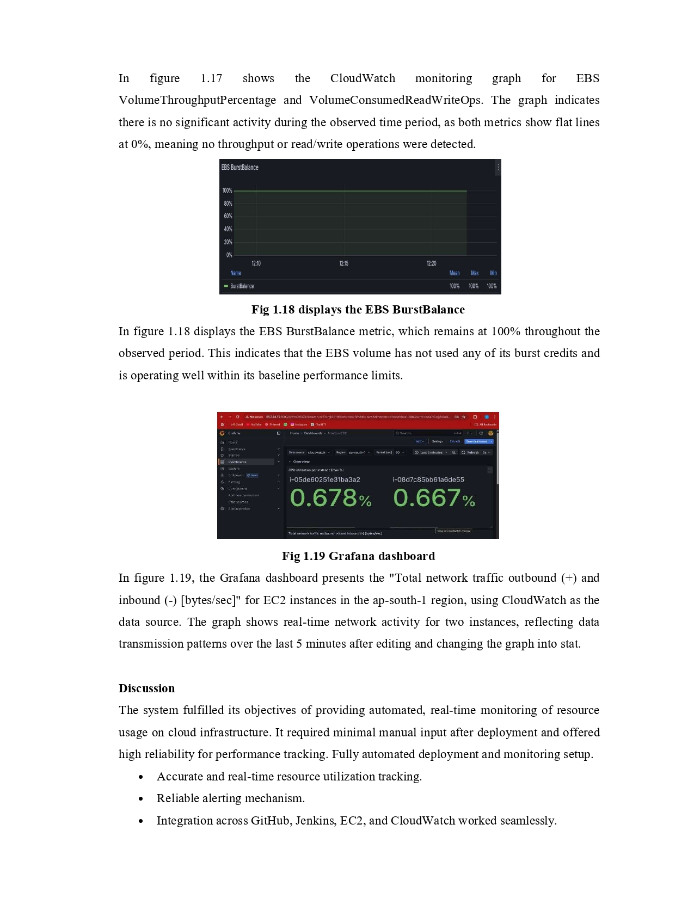

# CPU & Memory Performance Monitoring on AWS EC2  
### CloudWatch · CloudWatch Agent · SSM · Jenkins · Grafana

This project implements a complete cloud-based monitoring system that analyzes CPU utilization, memory usage, disk performance, and network activity of an AWS EC2 instance.  
The setup uses AWS-native monitoring tools along with automated configuration deployment and visualization through Grafana.

This repository contains a high-level project explanation and result outputs based on the implementation.

---

## 1. Project Overview

Monitoring system performance is essential for maintaining application reliability and resource optimization.  
AWS CloudWatch provides CPU metrics by default, but memory metrics require a dedicated **CloudWatch Agent**.

This project configures:
- **CloudWatch Agent** for detailed system metrics  
- **AWS Systems Manager (SSM)** for configuration management  
- **Jenkins automation** for applying configuration updates  
- **CloudWatch Dashboards** for visualization  
- **Grafana** for advanced metric dashboards  

The final setup provides end-to-end visibility into the health of an EC2 instance.

---

## 2. Architecture

The system uses the following pipeline:

EC2 Instance → CloudWatch Agent → CloudWatch Metrics → Dashboards / Grafana
↑
SSM + Jenkins Automation

### Component Roles
- **EC2 Instance:** Host machine for services  
- **CloudWatch Agent:** Collects CPU, memory, disk, and network metrics  
- **AWS CloudWatch:** Stores and graphs the collected metrics  
- **SSM Parameter Store:** Stores CloudWatch Agent configuration  
- **Jenkins:** Automates downloading and applying updated agent configuration  
- **Grafana:** Provides advanced visual dashboards using CloudWatch as a data source  

---

## 3. Block Diagram

  

### Block Diagram Description
- The **CloudWatch Agent** gathers OS-level metrics from the EC2 instance.  
- The **agent configuration** is stored in **AWS Systems Manager Parameter Store**.  
- **Jenkins Pipeline** retrieves config file updates and applies them on the EC2 instance.  
- Collected metrics flow into **AWS CloudWatch**.  
- Dashboards are visualized in both **CloudWatch** and **Grafana**.

---

## 4. Methodology

### 4.1 EC2 Setup
- Launched an Ubuntu EC2 instance  
- Attached IAM role with CloudWatch + SSM permissions  
- Opened necessary inbound ports

### 4.2 CloudWatch Agent Installation
Installed the agent using SSM and verified service status.

### 4.3 Configuration via SSM Parameter Store
- Created a JSON-based CloudWatch agent config  
- Stored it securely in Parameter Store  
- Allowed Jenkins to fetch and apply config updates

### 4.4 Jenkins Automation
- Pipeline pulls updated configuration from repository  
- Applies configuration remotely on EC2  
- Restarts CloudWatch Agent to load changes

### 4.5 Metric Collection
Collected:
- CPU utilization  
- Memory utilization  
- Disk I/O  
- Network traffic  
- File system usage  

### 4.6 Visualization
- CloudWatch Dashboard summarizes instance activity  
- Grafana uses CloudWatch API as a data source for visual analytics

---

## 5. Results

All performance monitoring outputs are included below as combined result images.

  
  
  
  
  
  
  

### Result Summary
- CPU utilization remained low during idle workloads  
- Memory graphs showed accurate tracking through the CloudWatch Agent  
- Disk operations and volume burst metrics remained stable  
- Network In/Out increased steadily during test execution  
- Grafana successfully displayed CloudWatch metrics in near real-time  
- CloudWatch Agent logged and published detailed OS-level metrics consistently

---

## 6. Conclusion

This project successfully demonstrates:
- How to install and configure the AWS CloudWatch Agent  
- How to collect system-level metrics not available by default (e.g., memory)  
- How to use SSM Parameter Store for centralized management  
- How Jenkins can automate deployment of updated configuration  
- How CloudWatch + Grafana together create a strong monitoring workflow  

The monitoring setup is reliable, scalable, and aligned with real-world DevOps practices.

---

## 7. Contact  

For inquiries or collaboration, please contact:  
**chandanats220304@gmail.com**

